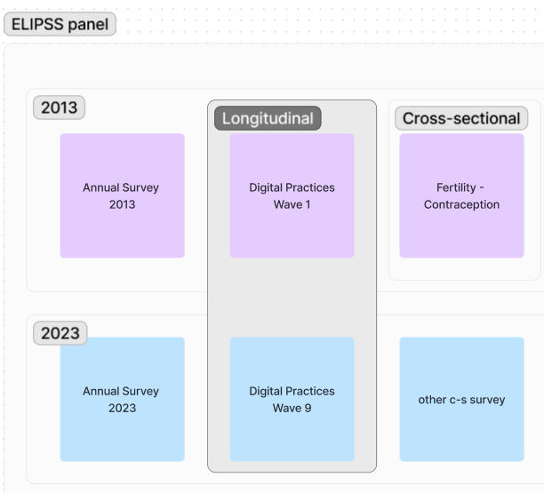

# Use case for the DDI representation of variables in repetitive contexts

## Introduction

In 2012, the Center for socio-political data (CDSP) set up the ELIPSS (Longitudinal Online Survey for the Social Sciences) Panel, an online survey instrument addressed to the academic community. It is a probability panel based on a sample of around 2,600 respondents who every month complete online questionnaires designed by social science research teams.

## General description
ELIPSS has a yearly core questionnaire (the Annual survey) to update sociodemographic data on panelists. Then, each month a new research survey is collected on a specific topic. The monthly survey can be cross-sectional (one-shot, for instance: fertility and birth control) or an additional wave of a longtudinal project (ex. Digital practices (wave 9)).

## Sources and variables

- Data files are shared with the research community based on:
  - annual survey only
  - longitudinal survey + data extracted from annual survey
  - cross-sectional survey + data extracted from annual survey
    
## What do we want to represent?

We want to represent the organisation at high level: studyUnit, Group (of studyUnit), ResourcePackage...?

## Example in pseudo-DDI
Gp: Group
SU: StudyUnit
RP: Resource Package

ELIPSS Panel (Gp)
- Metadata package (RP)
  *Reusable concepts, conceptual variables, represented variables, code lists for all surveys in ELIPSS Panel...*
- Annual survey (Gp)
  - Reusable metadata (RP)
   *Reusable concepts, conceptual variables, represented variables, code lists for all annual surveys...*
  
  - Annual survey 2013 (SU)
  - ...
  - Annual survey 2023
- Longitudinal survey (Gp)
  - Digital practices (Gp)
     *Reusable concepts, conceptual variables, represented variables, code lists for each waves of the same longitudinal project...*
    - Digital practices 2013 - Wave 1 (SU)
    - ...
    - Digital practices 2023 - Wave 9 (SU)
- Cross-sectional surveys (Gp)
  - Year 2013 (GP)
    - Fertility and birth control (SU)
      - Metadata package
         *Reusable concepts, conceptual variables, represented variables, code lists for each cross-sectional survey...*
   
## Questions and topics for discussion
