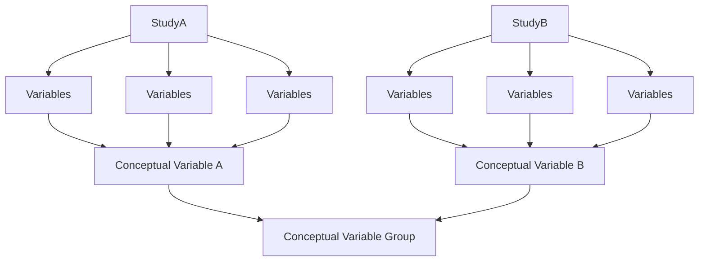
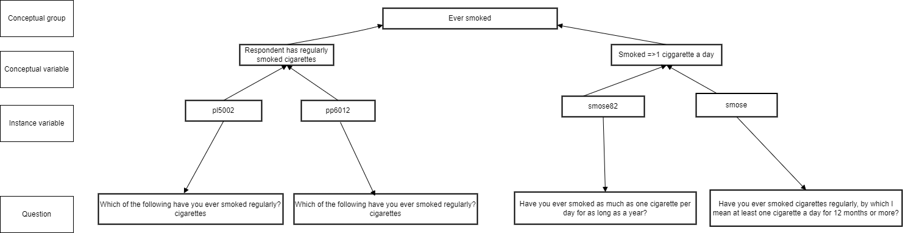
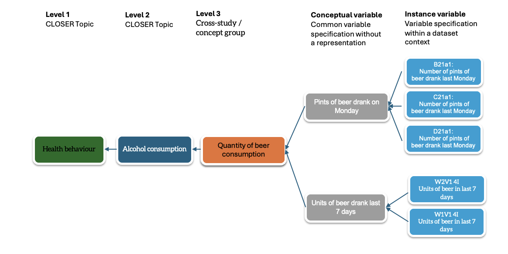

# CLOSER use case for the DDI representation of variables in repetitive contexts

## General description

- CLOSER Discovery is a multi-purpose discovery platform. Multi-purpose has a number of different contexts:
  - The subject areas are numerous
  - The users have different perspectives on how they want to use the available data resources
  - The representation of 'comparable' variables repeated within and across studies needs to reflect the various potential uses of the data
  - CLOSER will not (at least initially) attempt to 'harmonise' variables, e.g. to group variables using DDI Represented Variables
  - We are proposing to compare questions (text and response domain) to identify related variables generated from these questions and assign them to conceptual variables
 
To support cross-study discovery identification of comparable variables with comparable concepts;
  - a. cross study conceptual variable groups are created which reference study level conceptual variables
  - b. This enables a researcher to find similar variables across longitudinal population study (LPS) for potential harmonisation

## Sources and variables

- Data collection information is available which describes the data collection methodology coverage
- Questionnaires (instruments) describe the way in which data is collected, including the question items and the routing of the question items.
- Data available are one or more variables which are collected from a question in a survey or clinical instrument
- Variables reference their originating question, and derived variabled reference there source variables
- Variables and questions groups based on the CLOSER Topic vocabulary reference all questions and variables

### Abstract structure

### Example of variable representation

- Describe the repetitive aspect
  - Variables are referenced by the same conceptual variable within a single longitudinal study
  - Definition of a conceptual variable within a study is strongly related to the question item within a questionnaire
  - Conceptual variable groups are used to reference conceptual variables within more than one longitudinal study

## What do we want to represent?

- A conceptual group and description will be created at a cross-study level
- This will be nested within an existing topic / high level conceptual framework

## Relevent resources:
- https://doi.org/10.5281/zenodo.8001540 (Question driven equivalence - IAssist presentation)
- https://doi.org/10.5281/zenodo.8410617 (Towards Metadata Driven Harmonisation - ESRA presentation)
- https://wiki.ucl.ac.uk/display/CLOS/Topics (CLOSER variable/question groups)
- https://wiki.ucl.ac.uk/pages/viewpage.action?pageId=62790771 (CLOSER DDI Profile)
- https://harmonize.icpsr.umich.edu/Account/Login?returnUrl=%2F (NACDA portal)
- https://deepblue.lib.umich.edu/handle/2027.42/156403 (NACDA white paper from 2020)

