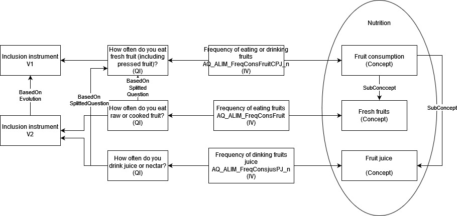

# Constances use case for the DDI representation of variables in repetitive contexts
*Constances is a "general purpose" population-based epidemiological cohort. It is a nationally representative sample of 200,000 adults aged between 18 and 69 (at inclusion). This epidemiological cohort is designed to contribute to the development of epidemiological research and provide information for public health purposes.*

*People who have agreed to take part in Constances receive a self-administered questionnaire (let's name it "questionnaire at inclusion"). A medical questionnaire asked by the doctor (intermediary) is also completed as part of inclusion process. A follow-up questionnaire is sent annually to Constances volunteers, and comprises a common core and questions that vary from year to year (named follow-up questionnaire code named F-yyyy where yyyy corresponds to the year).*

*The data collected via this protocol is then cleaned before being made available to the scientific community.*
## General description

In order to meet the requirements of researchers and various institutions using Constances data, a clear and precise description of the different available variables (at inclusion and follow-up) must be accessible. For this first use cases, we propose to focus on data about the consumption of fruits and juices.
Researchers want to retrieve data about the consumption of fruits (?).

## Sources and variables

A single choice question in the inclusion questionnaire V1 captures the frequency of comsumption of fruits. Each choice is represented by a checkbox.

A single choice question in the inclusion questionnaire V2 captures the frequency of comsumption of fresh fruits. Each choice is represented by a checkbox.

## What do we want to represent?
*To be completed*

## Precise example in pseudo-DDI
Ideas for DDI modelisation:

Instrument: Inclusion V1 
- Concept: Fruit consumption
  - Question: How often do you eat raw or cooked fruit (including 100% fruit juice)? / À quelle fréquence consommez-vous des fruits crus ou cuits (y compris les jus 100% fruit) ?
    - InstanceVariable: AQ_ALIM_FreqConsFruit

Instrument: Inclusion V2
- Concept: Fresh fruit consumption / Consommation de fruits frais?
- (BasedOn Previous question) How often do you eat fresh fruit (including pressed fruit)? / À quelle fréquence mangez-vous des fruits frais (y compris fruits pressés)?
  - Instance variable: AQ_ALIM_FreqConsFruitCPJ_n

- Concept: Fruit juice consumption / Consommation de jus de fruit?
- (BasedOn Previous question) How often do you drink juice or nectar?
  - Instance variable: AQ_ALIM_FreqConsjusPJ_n