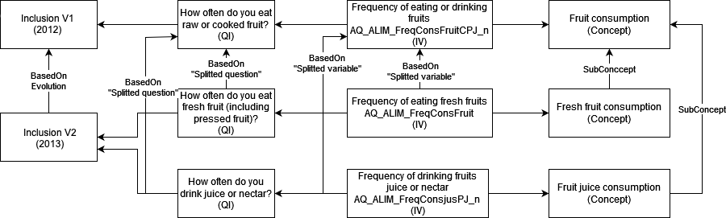

# Constances use case for the DDI representation of variables in repetitive contexts
*Constances is a "general purpose" population-based epidemiological cohort. It is a nationally representative sample of 200,000 adults aged between 18 and 69 (at inclusion). This epidemiological cohort is designed to contribute to the development of epidemiological research and provide information for public health purposes.*

*People who have agreed to take part in Constances receive a self-administered questionnaire (let's name it "questionnaire at inclusion"). A medical questionnaire asked by the doctor (intermediary) is also completed as part of inclusion process. A follow-up questionnaire is sent annually to Constances volunteers, and comprises a common core and questions that vary from year to year (named follow-up questionnaire code named F-yyyy where yyyy corresponds to the year).*

*The data collected via this protocol is then cleaned before being made available to the scientific community.*
## General description

Constances cohort captures data about fruits consumption in the follow-up questionnaires. In 2015, the variable on the frequency of fruit consumption was split into two variables : frequency of fresh fruits consumption and frequency of drink juice consumption.
Researchers want to retrieve data about the consumption of fruits and know the variable lifecycle.

## Sources and variables

A single choice question in the follow-up questionnaire 2014 captures the frequency of consumption of fruits. Each choice is represented by a checkbox.
From 2015, one single choice question in the follow-up questionnaire captures the frequency of consumption of fresh fruits. Another question captures the frequency of consumption of drink juice. Each choice is represented by a checkbox.

## What do we want to represent?
What we want to represent is the link between variables dealing with the highest level concept "fruits consumption" over time and the split into two variables.

## Precise example in pseudo-DDI
Ideas for DDI modelisation:

Instrument: Follow-up 2014 
- Concept: Fruit consumption
  - Question: How often do you eat raw or cooked fruit (including 100% fruit juice)? / À quelle fréquence consommez-vous des fruits crus ou cuits (y compris les jus 100% fruit) ?
    - InstanceVariable: Frequency of eating or drinking fruits - AQ_ALIM_FreqConsFruit

Instrument: Follow-up 2015
- Concept: Fresh fruit consumption / Consommation de fruits frais?
- (Splitted question based on previous question) How often do you eat fresh fruit (including pressed fruit)? / À quelle fréquence mangez-vous des fruits frais (y compris fruits pressés)?
  - Instance variable: Frequency of eating fresh fruits - AQ_ALIM_FreqConsFruitCPJ_n

- Concept: Fruit juice consumption / Consommation de jus de fruit?
- (Splitted question based on previous question) How often do you drink fruit juice or nectar?
  - Instance variable: Frequency of drinking fruits juice or nectar - AQ_ALIM_FreqConsjusPJ_n