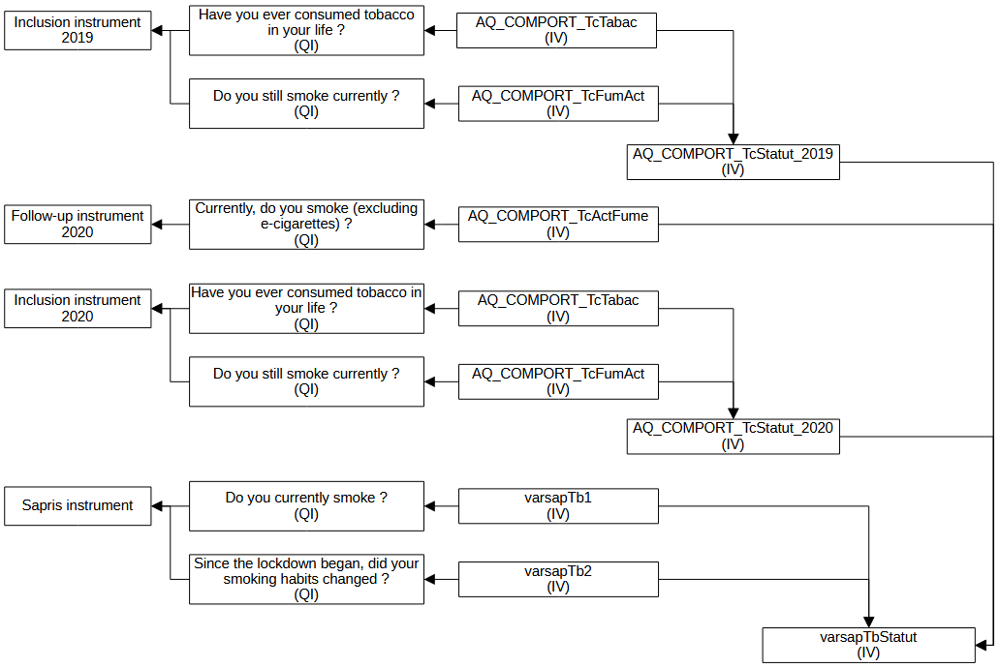

# Constances use case for the DDI representation of variables in repetitive contexts

*Constances is a "general purpose" population-based epidemiological cohort. It is a nationally representative sample of 200,000 adults aged between 18 and 69 (at inclusion). This epidemiological cohort is designed to contribute to the development of epidemiological research and provide information for public health purposes.*

*People who have agreed to take part in Constances receive a self-administered questionnaire (let's name it "questionnaire at inclusion"). A medical questionnaire asked by the doctor (intermediary) is also completed as part of inclusion process. A follow-up questionnaire is sent annually to Constances volunteers, and comprises a common core and questions that vary from year to year (named follow-up questionnaire code named F-yyyy where yyyy corresponds to the year).*

*The data collected via this protocol is then cleaned before being made available to the scientific community.*

## General description

From 2020 Constances took part in a  larger study called Sapris aiming at collecting data about the Covid pandemic’s. A complementary questionnaire was set-up and sent only to web participants from Constances. Among primary objectives was to determine the effect of tobacco on Covid symptoms.

The tobacco exposure of respondent is calculated in Sapris by combinating data from Sapris' questionnaires and previous standard Constances' questionnaires.

## Sources and variables

From Constances' inclusion questionnaire two collected variables are used to derive a calculated variable representing the smoking status of respondents when entering the cohort as *Non-smokers*, *Smokers*, *Ex-smokers* and *Missing Value*.

From Constances' follow-up questionnaire by asking if the respondents smoke a collected variable capture the current smoking status as *Yes (at least once a day)*, *No or occasionally* and *Missing Value*

In Sapris the somking status also distinguishes between *Regular smokers* and *Occasional smoker* by using two questions.

## What do we want to represent?

What we want to represent is the link between Constances and Sapris variable dealing with the changes in questions, codelists and universes.

## Precise example in pseudo-DDI

Ideas for DDI modelisation:

Instrument: Constances' inclusion

- Question: Have you ever consumed tobacco in your life ?
  - InstanceVariable: AQ_COMPORT_TcTabac
- Question: Do you still smoke currently ?
  - InstanceVariable: AQ_COMPORT_TcFumAct
- InstanceVariable (calculated): AQ_COMPORT_TcStatut_i

Instrument: Constances' follow-up
- Question: Currently, do you smoke (excluding e-cigarettes) ?
  - InstanceVariable: AQ_COMPORT_TcActFume

Instrument: Sapris
- Question: Do you currently smoke ?
  - InstanceVariable: varsapTb1
- Question: Since the lockdown began, did your smoking habits changed ?
  - InstanceVariable: varsapTb2
- InstanceVariable (calculated): varsapTbStatut

Variable: Constances' tobacco smoking status
- Universe : Constances' respondents
- Codelist : 
  - Category: Non-smokers 
  - Category: Smokers 
  - Category: Ex-smokers 
  - *Missing Value*

Variable: Sapris' tobacco smoking status
- Universe : Constances' web only respondents
- Codelist : 
  - Category: Never smoker
    -  never smoke before SAPRIS Study and declare on sapris (Do you currently smoke (=No) and Since the lockdown began, did your smoking habits changed (=No))
  - Category: Regular smoker
    - status before SAPRIS (=Smoker) and on SAPRIS ((Do you currently smoke (=Yes every day)) and ((Since the lockdown began, did your smoking habits changed (=No) or Since the lockdown began, did your smoking habits changed (=Yes, I smoke more)) 
  -	Category: Occasional Smoker
  	- only on Sapris ((Do you currently smoke (=Yes occasionally))
  -	Category: Former-smoker
  		-	smoker before Sapris study and declare on sapris (Do you currently smoke (=No) OR ex-smoker before Sapris study and declare on sapris (Do you currently smoke (=No) 
  -	Category: non-classified 