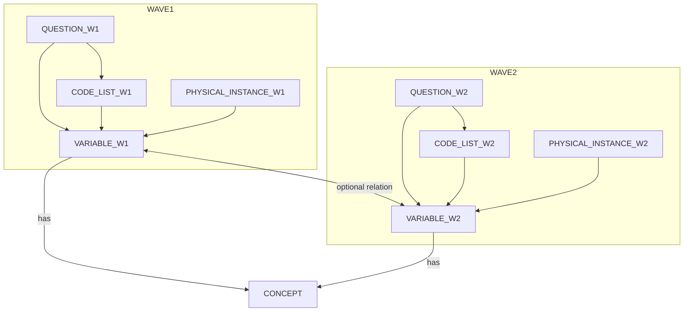
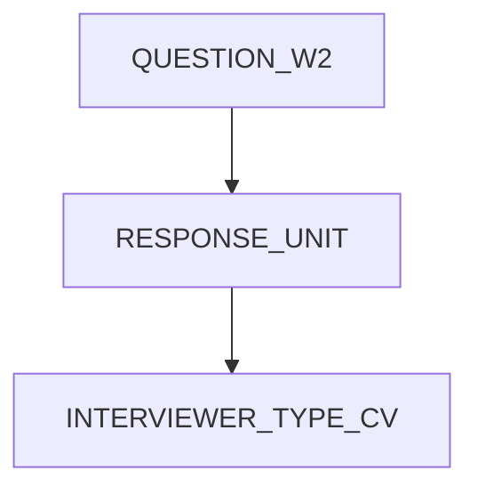

# France Cohortes : Elfe use case for the DDI representation of variables in repetitive contexts

## Introduction

France Cohortes (https://francecohortes.org/en/) is a french national infrastructur, with its roots in the academic world of health research, France Cohortes provides expertise in the science and analysis of health data, and is able to offer tools and services tailored to the needs of researchers.

To help them manage the many challenges they face, the France Cohortes national infrastructure :
- supports research teams running health cohorts throughout the life of the cohort,
- pools a range of specialised integrated services associated with a secure, high-performance public IT platform,
- facilitates the collection, processing and ethical re-use of data, guaranteeing respect for the rights and confidentiality of volunteers in cohort studies.

France Cohortes offers specialist services for collecting, securing, processing and sharing research data

The ultimate aim of France Cohortes is to :

- promote and sustain projects and the scientific exploitation of data produced by health cohorts,
- encourage the emergence of knowledge that can be used to prevent disease and improve care for all or part of the population.

France Cohortes is supported by a Programme d'investissement d'avenir (PIA) managed by the french Research agency, and is placed under the aegis of the Inserm
(coordinator), Ined, Université Paris-Saclay, Université Paris Cité and Sorbonne Université.

Elfe is a french cohort (https://www.elfe-france.fr/) following 20000 kids born in 2011, for 20 years. Elfe's retrospective data is in the process of being migrated to France Cohortes, and some future data collections might be conducted through France Cohortes' online form tools.

Elfe's use case is interesting as a use case because similar questions will be adapted to the age of the participant:
- Target respondents:
  - doctor or parents for young participants
  - teachers
  - participant himself when he is old enough
- Modalities of response
  - Phone
  - Online forms
  - ...

## General description

Elfe has been collecting environmental data on children for over a decade, with heterogeneous populations (age range) and ways of collecting data (tools for data collection, target respondent ...)

Next campaign is for 15 years old children, and a pilot has been conducted using France Cohortes tools and infrastructure.

Collected data concerns multiple environmental factors

- lifestyle during pregnancy
- statement of obstetric records
- sociodemographic data
- exposure to toxic substances, physical agents
- marital climate, family relationships
- organization of daily life
- characteristics of the accommodation
- living conditions
- use of care
- growth, child health, parental health
- development, temperament of the child
- child nutrition
- childcare, schooling of the child
- cultural practices, leisure
- environmental measures (dust trap, etc.)

Additionally for a subset of  8000 mother-child participants are collected biological measurements.

## Sources and variables

For each campaign, a form is defined and presented to participants through various tools. Data processing is done in SAS and data is managed in .sas7bdat  SAS database files.

All campaigns and associated variables have been documented extensively prior to migration into France Cohortes infrastructure. This documentation can be accessed publicly through: [https://pandora-elfe.inserm.fr](https://pandora-elfe.inserm.fr/public/)

For every campaign is provided

- A study protocol
  - Target population
  - Inclusion criteria
  - Consent process
  - Quick description of forms purpose
  - External sources of data
  - ...
- The form itself in .pdf format
- A documentation in .docx format
  - Purpose of study
  - Details on inclusion criteria
  - Gold standard for filling the form
  - Calculated variables
  - ...
- A description of variables in .xlsm format with hetergeneous formats and information about
  - Questions
    - Variable name (in form and database)
    - Question label
    - Type
    - Format
    - Description
    - Themes 1, 2, 3, 4 (eg. "développement psychomoteur","activités quotidiennes de l'enfant", ...)
  - Dictionaries
    - Value
    - Label
  - Weights to apply to some variables
  - ...

Only the variables catalog in .xlsm format is informatically parseable.

## What do we want to represent?

We want to represent the evolution of modalities of a same variable through different campaigns.

For example, 

| Campaign               | 2 - 3.5 years                                                | 5.5 years                                                    |
| ---------------------- | ------------------------------------------------------------ | ------------------------------------------------------------ |
| variable               | LANGENF                                                      | LANGENF                                                      |
| Target                 | Parent                                                       | Parent                                                       |
| Question FR            | En quelle(s) langue(s), dialecte ou patois **[Enfant Elfe]** s'exprime t'il/elle? | D'habitude en quelle(s) langue(s), dialecte ou patois **[Enfant Elfe]** s'exprime t'il le plus souvent? |
| Codes                  | 1, En français seulement \| 2, En français et une ou d'autres langues \| 3, Presque toujours dans d'autres langues que le français \| 4, Il/elle ne parle pas du tout | 1, Français \| ..... other languages                         |
| Multiple/Unique answer | Unique                                                       | Multiple                                                     |

For the same variable **LANGENF** we share,

- A variable name
- A target
- A similar, but not an exact match, question. The 5.5 years campaign introduces a frequency notion

But the modalities for answer are different.

Nonetheless there is also a possible, but not direct, alignment for answers to the questions in both campaigns.

| 2 - 3.5 years | 5.5 years             |
| ------------- | --------------------- |
| 1             | 1                     |
| 2             | 1 + any other code    |
| 3             | any other code than 1 |
| 4             | -                     |

N.B. Absence of answer for 5.5 years on LANGENF  cannot be aligned to 4 (not talking) in 2-3.5 years.

## Example in pseudo-DDI

*Not yet implemented in France Cohortes. Modelisation in DDI format is to be defined.*

### Describing the target respondent

